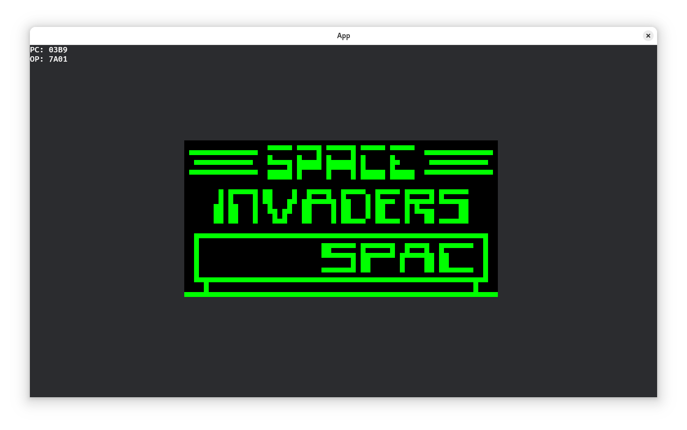

# Chip-8 Emulator in Rust with Bevy



## Description

This project is a Chip-8 emulator developed using the Rust and the Bevy game engine. It emulates the classic Chip-8 virtual machine, allowing you to run and experience vintage games on modern systems.

## Features

- **Chip-8 Emulation**: Accurately emulates the Chip-8 virtual machine, supporting a wide range of classic games.
- **Bevy Integration**: Utilizes the Bevy game engine for rendering and input handling.
- **Cross-Platform Support**: Runs on Windows, macOS, and Linux platforms.

## Installation

1. **Clone the Repository**:

```bash
git clone https://github.com/yourusername/chip8emu.git
cd chip8emu
cargo run path/to/your/romfile
```

Replace path/to/your/romfile with the path to the Chip-8 ROM you wish to run. You can find some ROMs [here](https://github.com/kripod/chip8-roms).

## Usage

After running the emulator, you can interact with it using the following keys:

1 2 3 4
Q W E R
A S D F
Z X C V

`Esc`: Restart the emulator.
